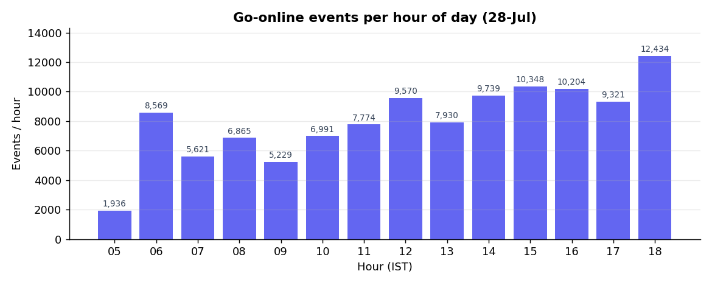
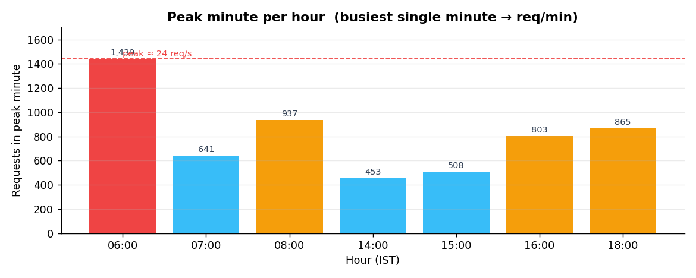

# ZepIris — Deployment Guide

Face verification service (go-online selfie vs enrolled selfie). Two processes:
**API** (FastAPI, orchestration + S3 fetch + cosine) → **ml_inference** (FastAPI,
CPU models: face detection + recognition). Runs pure 1:1 face match (liveness
gate off).

---

## 1. Measured performance

Response time, measured locally on an 8-core CPU against **real prod images**
(current config: liveness off, flip-TTA off, detector 512×512):

| Metric | Facematch |
|---|---|
| **Median (p50)** | **~0.75 s** |
| p90 | ~1.0 s |
| avg | ~0.77 s |
| min | ~0.22 s |
| n | 50 diverse prod pairs |

- Of the ~0.75 s, **~0.15 s is the S3 image fetch** (2 images, in parallel); actual model compute is **~0.6 s**.
- **Prod projection:** the prod EC2/Fargate CPU is slower than this laptop, but S3 is same-region (fetch ~30–50 ms), so the two roughly offset → expect **~0.5–1 s median on prod**.

### How it got here

| Version | Median (local) |
|---|---|
| Original | ~1.9 s (prod was 10–11 s) |
| detect-once + parallel S3 fetch + off-event-loop | ~0.7 s |
| + liveness gate OFF | ~0.4 s (tiny images) / ~1.1 s (real images) |
| **+ flip-TTA off + detector 512** (current) | **~0.75 s (real images)** |

Throughput anchor for sizing: **~3–4 req/s per 4 vCPU**.

---

## 2. Workload (real traffic, 28-Jul)

**Hourly volume** — busy hours run 8k–12k events/hr (~140–207 req/min avg):



**Peak minute** — the busiest single minute is what actually sizes the fleet.
Shift-start bursts spike far above the hourly average:



| | Value |
|---|---|
| **Peak minute (size for this)** | **~1,440 req/min ≈ 24 req/s** (06:00 shift-start burst) |
| Secondary peaks | 08:00 ≈ 937/min · 18:00 ≈ 865/min · 16:00 ≈ 803/min |
| Busy-hour average | ~12,400/hr ≈ 207/min ≈ 3.5 req/s |
| High-traffic bands | **morning 06:00–08:00** and **afternoon/evening 14:00–18:00** IST |
| Off-peak baseline | ~2k/hr ≈ 30–60/min ≈ ~1 req/s |

Note the burst shape: hour 06 averages ~143/min but its **peak minute hits 1,439**
(~10× the hourly average) — a sharp spike exactly at shift-start. Reactive
autoscaling can't spin up a model task inside a 1-minute burst (model load
~15–20 s), so the fleet must be **pre-warmed before 06:00 and before 14:00** via
scheduled scaling, with target-tracking as a safety net.

---

## 3. Recommended infra — AWS `ap-south-1` (same region as the S3 image bucket)

> Deploy in AWS Mumbai, same account/VPC as `earn-de-docs`. The hot path fetches
> images from S3 on every request — cross-cloud (GCP/serverless) would add S3
> egress cost + latency + PII/DPDP concerns. CPU is sufficient; **no GPU** at this
> volume.

### Option A — ECS Fargate (recommended)

| Service | Task size | Off-peak | Peak band | Throughput |
|---|---|---|---|---|
| **ml_inference** | **4 vCPU / 8 GB** | 1–2 tasks | **8 tasks** | ~3–4 req/s / task |
| **API** | **0.5 vCPU / 1 GB** | 1 task | 3 tasks | I/O only |
| ALB | — | 1 | 1 | — |

Sizing to the **peak minute (~24 req/s)**: 8 ml tasks × ~3.5 req/s ≈ **28 req/s > 24** (headroom for the 06:00 burst). Models need ~1–2 GB resident — keep memory ≥ 8 GB/task.
Off-peak (~1 req/s) → 1 task; busy-hour average (~3.5 req/s) is covered by 1–2 tasks, but the fleet is held at 8 through each peak band to absorb minute-bursts.

### Option B — EC2 (ECS-on-EC2 or plain ASG)

| Role | Instance | Off-peak | Peak band |
|---|---|---|---|
| ml_inference | `c7i.2xlarge` (8 vCPU / 16 GB, ~7 req/s) | 1 | **4** |
| — finer unit — | `c7i.xlarge` (4 vCPU / 8 GB, ~3.5 req/s) | 1 | 8 |
| API | `c7i.large` (2 vCPU / 4 GB) | 1 | 2 |

4× `c7i.2xlarge` ≈ 28 req/s > 24 req/s peak.

**Graviton alt:** `c7g.*` (ARM) — arm64 wheels work, ~15–20% cheaper. Use `c7i` (x86) for the most-tested wheel path.

---

## 4. Autoscaling (scheduled + reactive)

Two high-traffic bands per day; pre-warm before each, hold through, scale down after.

| Trigger (IST) | UTC cron | Action | Why |
|---|---|---|---|
| **05:50** (before 06:00 burst) | `cron(20 0 * * ? *)` | ml_inference → **8** | Pre-warm for the 1,439/min morning burst |
| **08:30** | `cron(0 3 * * ? *)` | scale **8 → 2** | Morning band over |
| **13:50** (before evening band) | `cron(20 8 * * ? *)` | → **8** | Pre-warm for 14:00–18:00 |
| **18:45** | `cron(15 13 * * ? *)` | scale **8 → 1** | Evening band over |
| **Target tracking** (backup) | — | ALB `RequestCountPerTarget` ≈ 200/target/min, or CPU 60% → add tasks | Absorbs off-schedule bursts |

- Cooldowns: scale-out 60 s (fast), scale-in 300 s (slow) — no flapping mid-band.
- **min ≥ 1** always (2 for AZ HA) — **never scale to zero**; cold model load (~15–20 s) would drop the first requests.
- Run peak-band tasks on **Fargate Spot** (~70% cheaper; bursts are interruption-tolerant); keep the 1–2 baseline tasks on-demand.

Example — morning pre-warm (Application Auto Scaling):
```bash
aws application-autoscaling put-scheduled-action --service-namespace ecs \
  --resource-id service/zepiris/ml-inference \
  --scalable-dimension ecs:service:DesiredCount \
  --scheduled-action-name prewarm-morning \
  --schedule "cron(20 0 * * ? *)"   `# 05:50 IST = 00:20 UTC` \
  --scalable-target-action MinCapacity=8,MaxCapacity=8
# 08:30 scale-in:  cron(0 3 * * ? *)   -> MinCapacity=2,MaxCapacity=8
# 13:50 pre-warm:  cron(20 8 * * ? *)  -> MinCapacity=8,MaxCapacity=8
# 18:45 scale-in:  cron(15 13 * * ? *) -> MinCapacity=1,MaxCapacity=8
```

---

## 5. Cost (ap-south-1, on-demand, approx)

Peak bands run ~7.5 h/day total (morning ~2.5 h + evening ~5 h) at 8 tasks; off-peak 1–2 tasks the rest of the time.

| | Cost |
|---|---|
| Baseline (1–2× 4vCPU/8GB on-demand, 24/7) | ~$160–320/mo |
| Peak bands (extra ~6 tasks × ~7.5 h/day on **Spot**) | ~$100/mo |
| **Total (Fargate)** | **~$260–420/mo** |
| EC2 equivalent (c7i on-demand + Spot for peak) | ~$450–600/mo |

Fargate + Spot for the peak bands is the sweet spot. A GPU (`g5.xlarge`, ~$900/mo) would sit idle ~90% of the day for a 24 req/s peak — **skip it** until you're at hundreds of req/s.

---

## 6. Runtime config (env)

| Env | Value | Effect |
|---|---|---|
| `ZEPIRIS_ML_INFERENCE_SERVICE_URL` | `http://ml-inference:8001` | API → ml_inference |
| `ML_SERVICE_FACE_DETECTION_WIDTH/HEIGHT` | `512` | faster detection (default) |
| `ML_SERVICE_FACE_ENABLE_FLIP_TTA` | `false` | ~halves recognition (default) |
| liveness gate | removed in code | pure 1:1 match |

Tradeoffs already applied for speed: **liveness off** (a printed photo / screen replay of the
enrolled selfie passes on match score alone) and **TTA off** (~0.02–0.03 lower genuine
scores, still well clear of the 0.5 threshold). Set `ML_SERVICE_FACE_ENABLE_FLIP_TTA=true`
to trade some speed back for robustness on blurry document photos.

---

## 7. Further optimization (before scaling hardware)

- **Pre-compute enrolled-selfie embeddings** (store per user in Redis / Milvus). The reference
  never changes per go-online event — embedding it every time is wasted work + one extra S3
  fetch. Cuts per-request compute ~50% and removes one fetch → roughly doubles capacity.
- Load-test with k6/Locust against one task to get the true per-node req/s before finalizing counts.
